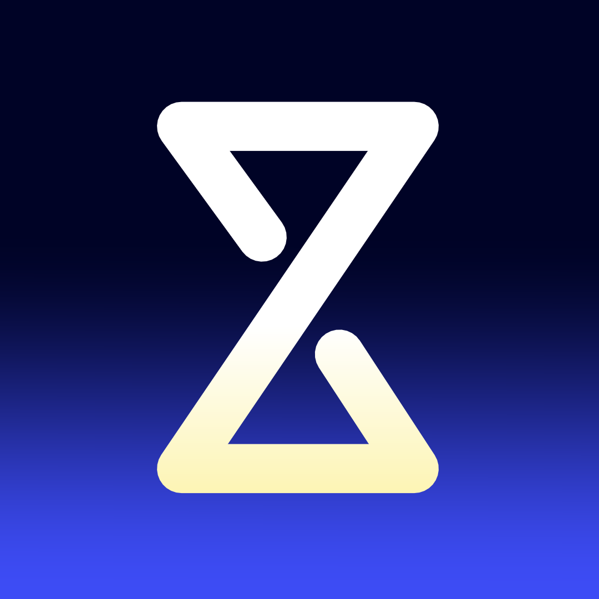
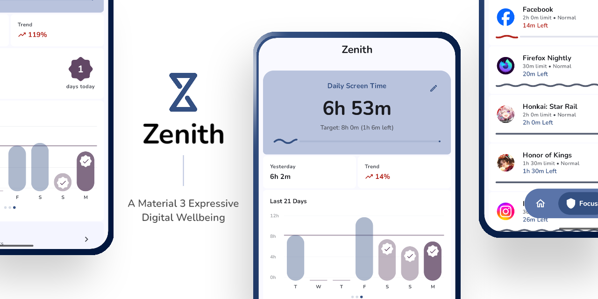
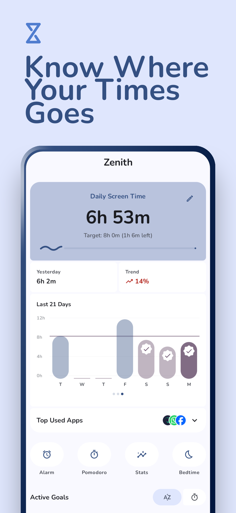
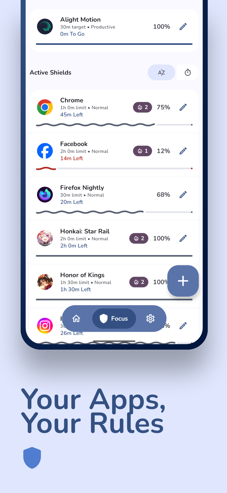
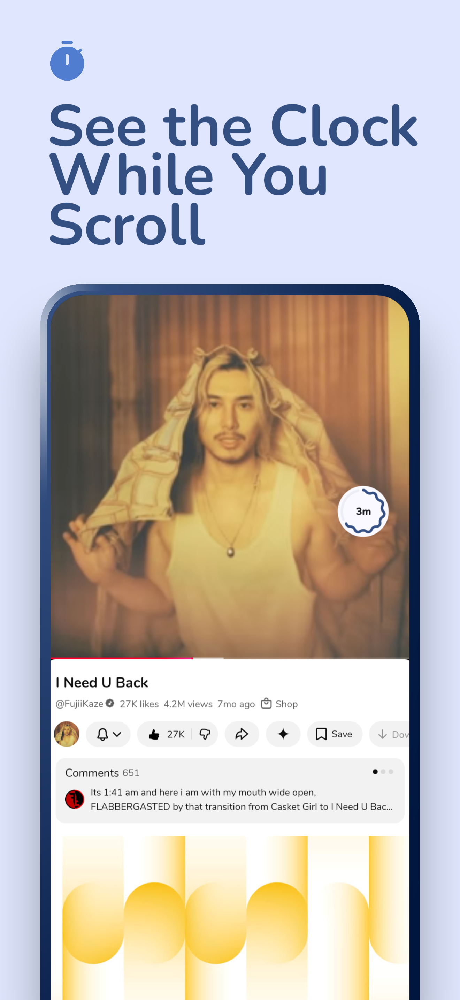
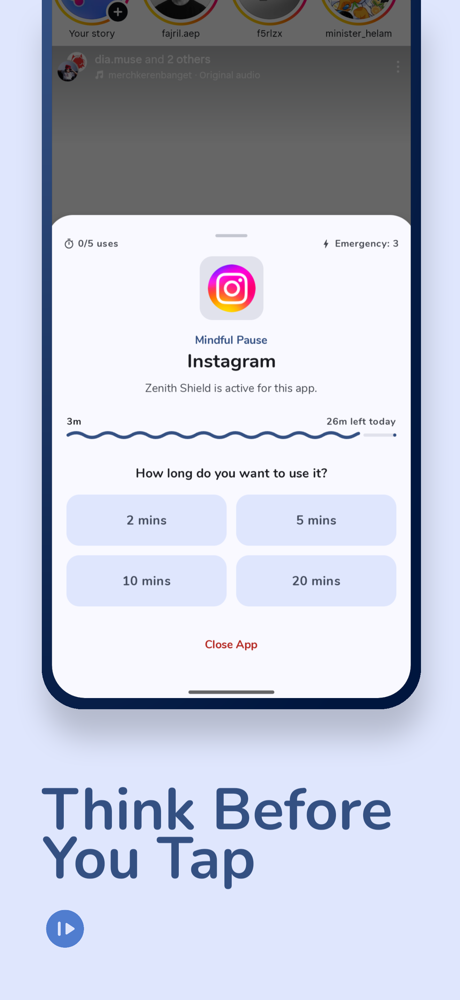
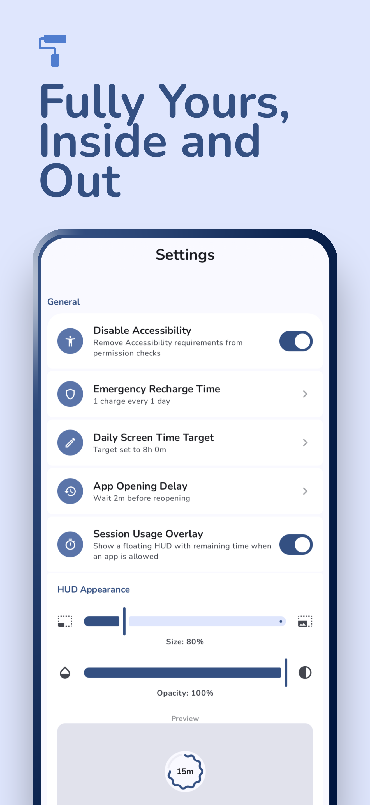

  

# Zenith - A Material Design 3 Expressive Digital Wellbeing App

  

**Zenith** is a smart digital wellbeing assistant for Android, built with **Material Design 3 Expressive**. It uses proactive interventions and real-time monitoring to help you break addictive scrolling habits through a fluid, motion-rich experience.

## Screenshots

  <table>
    <tr>
      <td width="33%"></td>
      <td width="33%"></td>
      <td width="33%"></td>
    </tr>
    <tr>
      <td width="33%"></td>
      <td width="33%"></td>
      <td width="33%"></td>
    </tr>
  </table>

## Key Features

- **Shield Mode**: Protects you from addictive applications by providing mindful pauses and limiting the number of uses per period.
- **Goal Pursuit**: Helps you achieve usage time targets for specific applications (e.g., educational or productivity apps).
- **Delay App**: Forces a time delay (e.g., 5-10 seconds) before protected apps can be opened, allowing the brain a moment to reconsider.
- **Smart Schedules**: Automatically block or allow applications based on specific time schedules.
- **Emergency Use**: A hold-to-unlock system for emergency usage when limits are reached, with a restricted quota.
- **Session HUD**: A floating overlay that transparently shows the remaining time for an active application session.
- **Expressive Design**: Built with Material Design 3 Expressive guidelines, featuring fluid animations and a modern interface.

## Installation Guide

1. Clone this repository.
2. Open it in Android Studio Ladybug or a newer version.
3. Ensure Android SDK 33+ is installed.
4. Build and run on a physical device (recommended as it requires Accessibility Service permissions).

## Required Permissions

To function optimally, Zenith requires:
1. **Accessibility Service**: To instantly detect foreground application changes and manage app interventions.
2. **Usage Access (PACKAGE_USAGE_STATS)**: To accurately calculate daily application usage statistics.
3. **Overlay Permission (SYSTEM_ALERT_WINDOW)**: To display Shield intervention screens and the Session HUD over other applications.
4. **Notification Permission (POST_NOTIFICATIONS)**: To provide persistent updates and alerts regarding your focus status.
5. **Foreground Service**: To maintain real-time monitoring of app usage for effective digital wellbeing.

## License

This project is created for learning and self-development purposes.
[GNU GPL v3.0](LICENCE)
